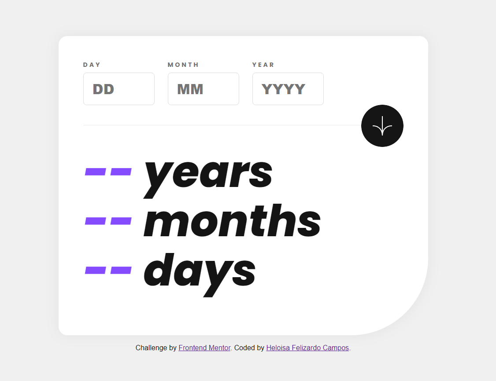

# Frontend Mentor - Age calculator app solution

This is a solution to the [Age calculator app challenge on Frontend Mentor](https://www.frontendmentor.io/challenges/age-calculator-app-dF9DFFpj-Q). Frontend Mentor challenges help you improve your coding skills by building realistic projects.

## Table of contents

- [Overview](#overview)
  - [The challenge](#the-challenge)
  - [Screenshot](#screenshot)
  - [Links](#links)
- [My process](#my-process)
  - [Built with](#built-with)
  - [What I learned](#what-i-learned)
  - [Continued development](#continued-development)
  - [Useful resources](#useful-resources)
- [Author](#author)
- [Acknowledgments](#acknowledgments)

## Overview

### The challenge

Users should be able to:

- View an age in years, months, and days after submitting a valid date through the form
- Receive validation errors if:
  - Any field is empty when the form is submitted
  - The day number is not between 1-31
  - The month number is not between 1-12
  - The year is in the future
  - The date is invalid e.g. 31/04/1991 (there are 30 days in April)
- View the optimal layout for the interface depending on their device's screen size
- See hover and focus states for all interactive elements on the page
- **Bonus**: See the age numbers animate to their final number when the form is submitted

### Screenshot



### Links

- Solution URL: [Github](https://github.com/HeloisaFelizardo/age-calculator-app)
- Live Site URL: [Age Calculator App](https://heloisafelizardo.github.io/age-calculator-app/)

## My process

### Built with

- Semantic HTML5 markup
- CSS custom properties
- SASS
- Flexbox
- Mobile-first workflow
- JavaScript

### What I learned

It took me 15 days to develop this project. Of course, there were days when I didn't even touch it, but counting from the initial date, it was 15 days.

My biggest challenges in completing this project were the validations, finding the right logic to make it work, date validation; I had a lot of difficulty with it, and even so, the project is not perfect because there are still some bugs to fix.

Overall, I really enjoyed doing this project because it helped me solidify my knowledge, even though I know it's far from perfect, but for me, it was already very rewarding to accomplish it.

Both functions have the same purpose of checking if a day is valid for a given month. However, they are implemented in slightly different ways.

The first function uses a fixed array of days for all months, while the second function uses an array of days specific to each month. In terms of efficiency, the second approach may be preferable, as it allows setting the correct number of days for each month, including February in leap years.

```js
// Function to validate the provided day and month.
function validateData(day, month) {
  let invalidDate = false;
  let daysInMonth = [31, 29, 31, 30, 31, 30, 31, 31, 30, 31, 30, 31];

  // Check if the day is valid for the provided month
  for (let i = 0; i < daysInMonth.length; i++) {
    if (day > daysInMonth[month - 1]) {
      invalidDate = true;
    }
  }
  return invalidDate;
}
```

```js
// Function to validate the provided day and month.
function validateData(day, month) {
  if (day <= 0 || day > 31) {
    return true; // Returns true if the day is out of the valid range
  }

  // Get the number of days in the provided month
  let daysInMonth = new Date(today.getFullYear(), month, 0).getDate();
  // Return true if the provided day is greater than the number of days in the month
  return day > daysInMonth;
}
```

## Author

- Website - [Heloisa Felizardo](https://heloisafelizardo.github.io/)
- Frontend Mentor - [@HeloisaFelizardo](https://www.frontendmentor.io/profile/HeloisaFelizardo)
